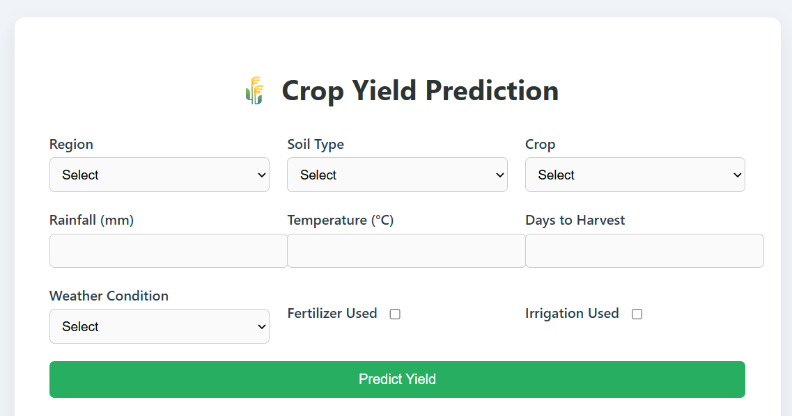

# 🌾 Crop Yield Prediction Web App

A **Flask web app** to predict agricultural crop yield based on climate, soil, and crop parameters using machine learning models.

---

## 🚀 Features

🔢 **Input Parameters**  
Enter details like region, soil type, rainfall, temperature, and crop to get yield predictions.

🤖 **Multiple ML Models Used**  
- Linear Regression  
- Ridge Regression  
- Gradient Boosting  
- LightGBM  
- CatBoost
- XGBoost

📈 **Prediction Comparison**  
Get predictions from all models and compare their outputs instantly.

🧪 **Real-time**  
- Submit form for real-time yield prediction  

📊 **Clean UI with Form Controls**  
Dropdowns for categorical fields, toggle switches for boolean options, and input boxes for numeric values.

---

## 📸 Demo

### 📝 Input Form

### 📊 Prediction Output

---

## 🧰 Technologies Used

- 🐍 Python  
- 🔥 Flask  
- 📦 Scikit-learn, Pandas, NumPy  
- 📊 LightGBM, CatBoost, Gradient Boosting  
- 🎨 HTML, CSS  
- 🎯 Bootstrap for UI styling

---

## 📁 Input Parameters

| Parameter | Type | Options / Example |
|----------|------|-------------------|
| Region | Dropdown | North, South, East, West |
| Soil_Type | Dropdown | Clay, Sandy, Loam, Silt, Peaty, Chalky |
| Crop | Dropdown | Wheat, Rice, Maize, Barley, Soybean, Cotton |
| Rainfall_mm | Numeric | e.g., 350 |
| Temperature_Celsius | Numeric | e.g., 27 |
| Fertilizer_Used | Checkbox | Yes / No |
| Irrigation_Used | Checkbox | Yes / No |
| Weather_Condition | Dropdown | Sunny, Rainy, Cloudy |
| Days_to_Harvest | Numeric | e.g., 120 |

---
